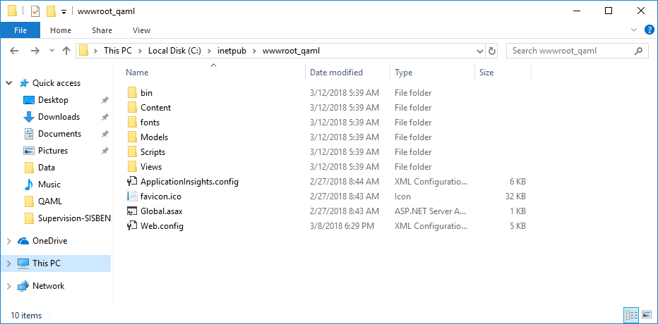
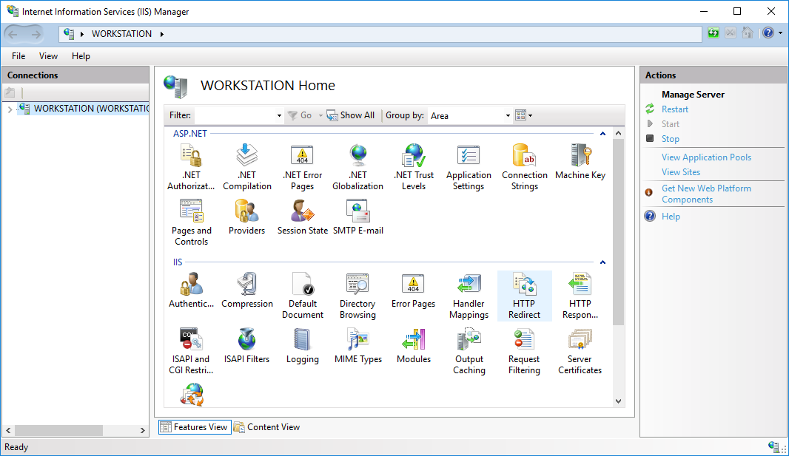
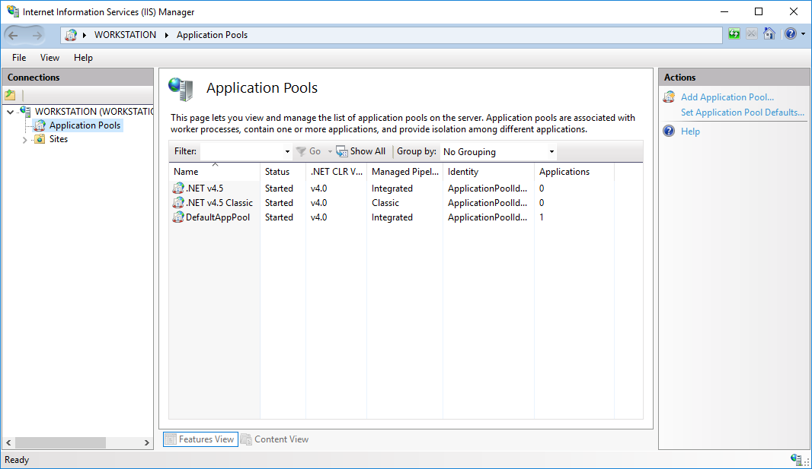
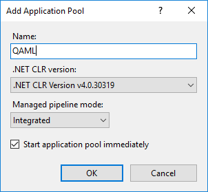
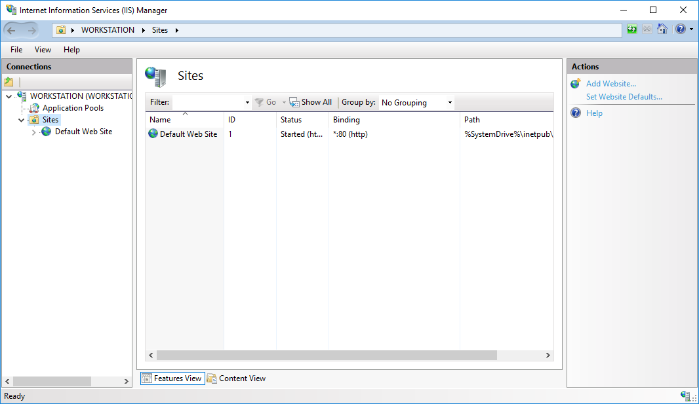
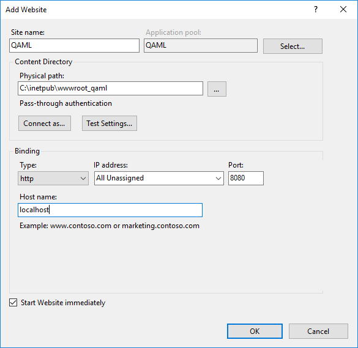
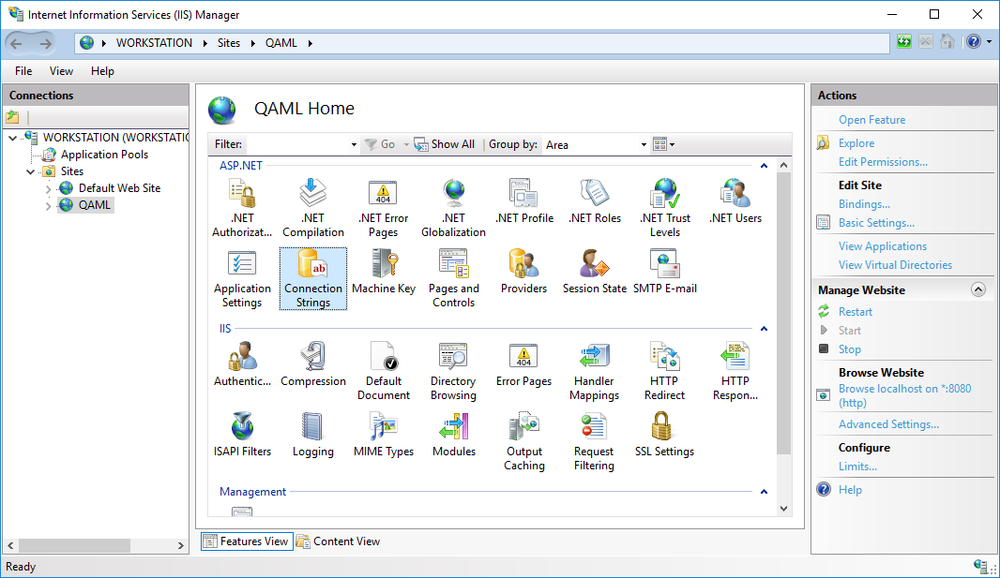
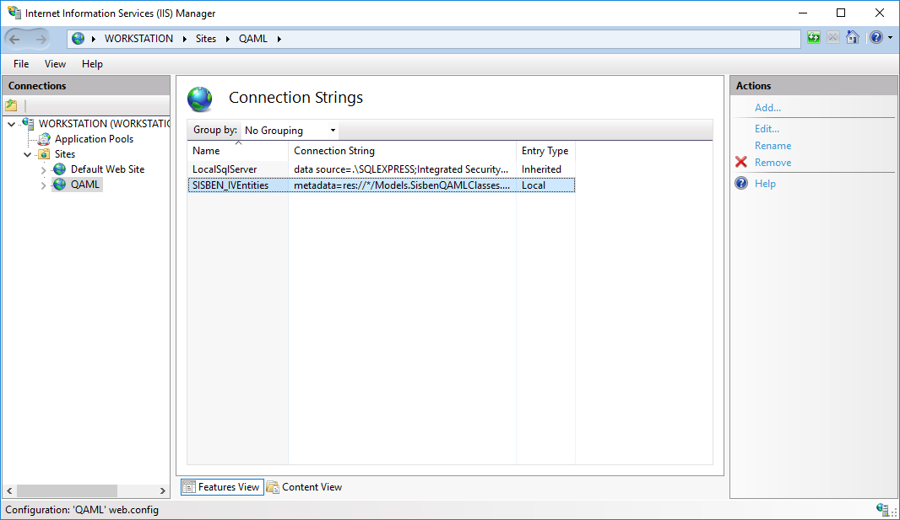
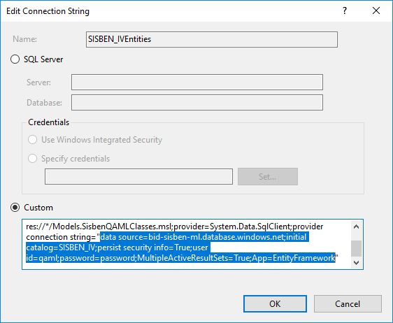

# Visualizador de Indicadores del Clasificador de Hogares SISBEN

Este documento contiene los requisitos, dependencias y procedimiento de instalación de la aplicación de visualización de indicadores del clasificador.

## Requisitos

### Hardware
---
Para poder utilizar esta aplicación el mínimo de hardware requerido es:

* Procesador: 1GHz, 1 core
* Memoria RAM: 512MiB
* HDD: 100MiB

### Software
---
Para poder instalar y utilizar esta aplicación, es necesario cumplir con los siguientes requisitos de software:

* Windows Server 2008 R2 SP1 o superior
* [Microsoft .NET Framework 4.6.1](https://www.microsoft.com/en-us/download/details.aspx?id=49982 ".NET Framework 4.6.1 Offline Installer") o superior
* Microsoft SQL Server 2008 R2 o superior
* Binarios de la aplicación (PublishOutput)

## Dependencias
Los paquetes de dependencias de este proyecto están definidos en el archivo [packages.config](src/Sisben.WebApps.QAML/packages.config).

## Procedimiento de instalación
Para instalar la aplicación Web para la visualización de indicadores, siga los siguientes pasos:

1. Crear directorio raíz y copiar archivos binarios
3. Crear nuevo grupo de aplicaciones (Application Pool)
4. Crear nuevo sitio Web
5. Configurar cadena de conexión (ConnectionString)
6. Probar aplicación

### Crear directorio raíz
---
Cree un directorio raíz donde serán colocados los binarios de la aplicación:

### Crear nuevo grupo de aplicaciones (Application Pool)
---
Inicie la consola de administración de IIS.

Haga clic en **Application Pools** en el panel de la izquierda.

Haga clic en **Add Application Pool...** en el panel de la derecha y llene los datos para la creación del nuevo grupo de aplicaciones.

### Crear nuevo sitio Web
---
Haga clic en **Sites** en el panel de la izquierda.

Haga clic en **Add Website...** en el panel de la derecha y llene los datos para la creación del nuevo sitio Web.

### Configurar cadena de conexión (ConnectionString)
---
Haga clic en **QAML** en el panel de la izquierda bajo el sub-menú **Sites**.

Haga doble clic en el ícono **Connection Strings**.

Haga doble clic en la cadena de conexión con el nombre **SISBEN_IVEntities** y modifique la cadena de conexión para conectarse a la base de datos con la cuenta correspondiente en su dominio.

### Probar aplicación
---
En un explorador de Internet entre la dirección URL de la aplicación. Al hacer esto, debe mostrarle la siguiente página:

